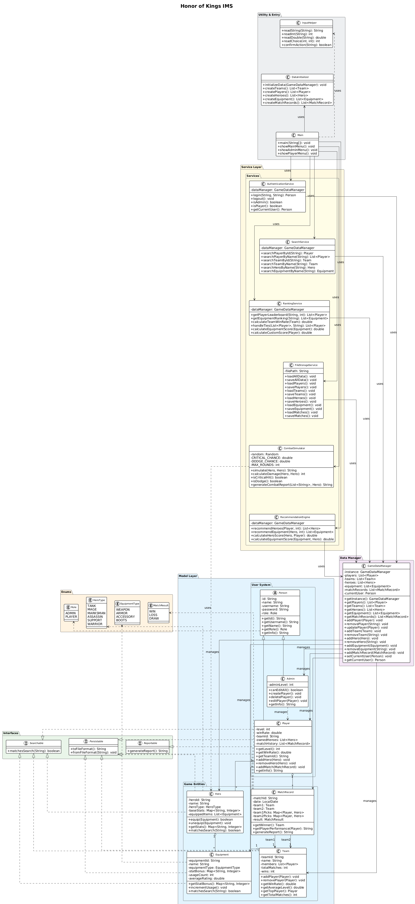

# AI-Assisted Honor of Kings Information Management System - Project Plan

## 1. Project Goal

Develop a Java OOP console application to manage Honor of Kings game data including
players, heroes, equipment, teams, and match records. Users are divided into two roles:
Admin (full data management permissions) and Player (view public data and edit own
profile only). The system runs as a console menu application, with a Swing GUI and
additional features implemented as extra credit.

---

## 2. Requirement Analysis

### 2.1 Core Features

| Feature | Implementation Details |
|---------|----------------------|
| Player Lookup | Search by ID or name; display team, level, win rate, owned heroes, equipped items |
| Team Overview | Search by ID or name; display members, average level, total matches, win rate, top player |
| Hero Details | Search by name; display type, base stats, compatible equipment, owners, recommended equipment |
| Equipment Statistics | Rank by usage count, average rating, and heroes using it; formula explained in Section 6 |
| Match History | Retrieve last N matches for player or team; show opponent, date, result, hero picks, win/loss record, hero pick rate |
| Leaderboard | Top X players by win rate, level, match count, or custom score; ties resolved alphabetically by username |
| Data Management | Admin: add/delete/edit players, heroes, equipment, teams, match records. Player: view self, edit limited info, view public data |
| Authentication | Login and logout with Admin and Player roles; role-based permission control |

### 2.2 Extra Credit Features

| Feature | Details |
|---------|---------|
| Combat Simulation | Turn-based battle using hero stats and equipment; damage calculation, critical hits, dodge, combat report output |
| Recommendation Engine | Recommend heroes and equipment based on win rate, usage frequency, and type compatibility; formula explained in Section 6 |
| GUI | Swing-based graphical interface covering login, player lookup, team overview, hero details, leaderboard |
| Data Persistence | Save and load all data using JSON files in the data/ folder |
| Advanced AI Reflection | Compare two AI agent roles solving the same problem; analyze correctness, readability, and learning value |

---

## 3. Java Concepts Used

| Concept | Where It Is Used |
|---------|-----------------|
| Inheritance | Player and Admin extend abstract class Person |
| Interface | Searchable (matchesQuery), Reportable (generateReport), Persistable (toFileFormat, fromFileFormat) |
| Polymorphism | Person references store both Player and Admin objects; common operations handled uniformly |
| Encapsulation | All fields private; accessed and validated through getters and setters |
| Collections | ArrayList for hero/player lists; HashMap for ID-to-object lookup; TreeMap for sorted rankings |
| Exception Handling | Custom exceptions for missing records, duplicate IDs, invalid input, and file I/O errors |
| File I/O | FileStorageService reads and writes JSON files in the data/ folder |
| Enums | HeroType (TANK, MAGE, MARKSMAN, ASSASSIN, SUPPORT, WARRIOR), MatchResult (WIN, LOSS, DRAW), Role (ADMIN, PLAYER), EquipmentType (WEAPON, ARMOR, ACCESSORY, BOOTS) |

---

## 4. Class Design

### 4.1 Model Package

| Class | Fields | Key Methods |
|-------|--------|-------------|
| Person (abstract) | id, name, username, password, role: Role | getId(), getUsername(), getName(), getRole(), getInfo() (abstract) |
| Player extends Person | level, winRate, teamId, ownedHeroes: List\<Hero\> | addHero(), removeHero(), getWinRate() |
| Admin extends Person | adminLevel: int | canEditAll(), createPlayer(), deletePlayer(), editPlayer() |
| Hero | heroId, name, heroType: HeroType, baseStats: Map\<String,Integer\>, equippedItems: List\<Equipment\> | equip(), unequip(), getStats() |
| Equipment | equipmentId, name, equipmentType: EquipmentType, statBonus: Map\<String,Integer\>, usageCount, averageRating | getStatBonus(), incrementUsage() |
| Team | teamId, name, members: List\<Player\>, totalMatches, wins | getWinRate(), getAverageLevel(), getTopPlayer(), addPlayer(), removePlayer() |
| MatchRecord | matchId, date: LocalDate, team1, team2, team1Picks: Map\<Player,Hero\>, team2Picks: Map\<Player,Hero\>, result: MatchResult | getWinner(), getPlayerPerformance() |

### 4.2 Service Package

| Class | Responsibility |
|-------|---------------|
| GameDataManager | Singleton; holds all data collections; central add/delete/update/find methods for all entities |
| AuthenticationService | Login/logout; role checking; current user session management |
| SearchService | Search players by ID/name; search teams by ID/name; search heroes by name; search equipment by name |
| RankingService | Player leaderboard by multiple criteria; equipment ranking; tie handling |
| FileStorageService | Save and load all data to JSON files; handle file not found and format errors |
| CombatSimulator | Turn-based combat between two heroes; damage = attackPower * (1 + random 0-0.3) - defense * 0.5; 10% critical hit (x2); 5% dodge (0 damage); max 20 rounds |
| RecommendationEngine | Score and recommend heroes and equipment based on player history and statistics |

### 4.3 Utility Package

| Class | Responsibility |
|-------|---------------|
| InputHelper | Wrap Scanner; provide readInt(), readString(), readDouble(); handle invalid input without crashing |
| DataInitializer | Hard-code initial dataset; create 3 teams, 15 heroes, 20 equipment items, 10 match records |

---

## 5. UML Diagram



### Class Relationships Summary

- Person (abstract) <|-- Player
- Person (abstract) <|-- Admin
- Player "1" --> "*" Hero : owns
- Hero "1" --> "*" Equipment : uses
- Team "1" --> "*" Player : contains
- MatchRecord --> "2" Team : participants
- Admin ..> Player : manages
- Player ..|> Searchable
- Team ..|> Searchable
- Hero ..|> Searchable
- MatchRecord ..|> Reportable
- Player ..|> Persistable
- Hero ..|> Persistable
- GameDataManager manages all model classes
- All services ..> GameDataManager : uses
- Equipment ..|> Searchable
- Equipment ..|> Persistable
- Team ..|> Persistable
- MatchRecord ..|> Persistable
- CombatSimulator ..> Hero : uses
- RecommendationEngine ..> GameDataManager : uses
- Main ..> CombatSimulator : uses
- Main ..> RecommendationEngine : uses
- Main ..> DataInitializer : uses
- Player "1" --> "*" MatchRecord : has history
---

## 6. Data Design

### 6.1 Initial Dataset

| Data Type | Minimum Required | Planned Amount |
|-----------|-----------------|----------------|
| Teams | 3 | 3: "Dragon Slayers", "Phoenix Rise", "Tiger Guard" |
| Players | 10 | 15 (5 per team) |
| Heroes | 15 | 15 covering all HeroTypes |
| Equipment | 20 | 20 covering all EquipmentTypes |
| Match Records | 10 | 10 between teams with full hero picks |

### 6.2 Ranking and Scoring Formulas

**Equipment Ranking Score:**
```
Score = (usageCount / maxUsageCount) * 0.4 + (averageRating / 5.0) * 0.6
```
*Explanation: usageCount is normalized by dividing by the maximum usage count
to avoid scale bias between large and small numbers. averageRating is normalized
by dividing by 5.0 (the maximum possible rating). Weight 0.4 is assigned to
popularity (usage) and 0.6 to quality (rating) because a well-rated item should
rank higher than a frequently used but poorly rated one.*

---

**Hero Recommendation Score:**
```
Score = winRate * 0.5 + usageFrequency * 0.3 + typeCompatibility * 0.2
```
*Explanation: winRate (0.0 to 1.0) is the most important factor because it
directly measures a hero's effectiveness for the player. usageFrequency
(normalized 0.0 to 1.0) reflects familiarity — a hero the player uses often
is easier to play well. typeCompatibility (0.0 or 1.0) gives a small bonus
when the hero type matches the player's preferred role. Weights sum to 1.0.*

---

**Equipment Recommendation Score:**
```
Score = (usageCount / maxUsageCount) * 0.4 + (averageRating / 5.0) * 0.6
```
*Explanation: Same normalization approach as Equipment Ranking. For
recommendations, quality (rating) is weighted slightly higher than popularity
(usage) because we want to suggest the best-performing equipment, not just
the most common one. Both values are normalized to the range 0.0 to 1.0
before weighting to ensure fair comparison.*

---

**Custom Leaderboard Score:**
```
Score = winRate * 0.6 + (level / maxLevel) * 0.3 + (matchCount / maxMatches) * 0.1
```
*Explanation: winRate carries the highest weight (0.6) because it best
reflects overall skill. level (normalized by maxLevel) accounts for
experience and progression, weighted at 0.3. matchCount (normalized by
maxMatches) reflects activity and is weighted lowest at 0.1 because playing
many games does not necessarily indicate skill. All three components are
on a 0.0 to 1.0 scale and weights sum to 1.0.*

---

**Tie Handling:**
When two or more players have identical scores on any leaderboard, ties are
resolved alphabetically by username in ascending order (A before Z). This
ensures a consistent, predictable, and fair ordering that does not favour
any player arbitrarily.

### 6.3 Storage Format

- Development Phase: hard-coded in DataInitializer
- Final Phase: JSON files in data/ folder
    - data/players.json
    - data/teams.json
    - data/heroes.json
    - data/equipment.json
    - data/matches.json

---

## 7. AI Usage Plan

| Agent Role | Tool | Allowed Tasks | Not Allowed |
|------------|------|--------------|-------------|
| Architect Agent | Claude / ChatGPT | Class design, UML suggestions, interface planning, module structure | Generate complete working code |
| Implementation Agent | Claude / ChatGPT | Implement one method or one class at a time | Generate the entire project at once |
| Testing/Reviewer Agent | Claude / ChatGPT | Bug finding, test case suggestions, code review, edge case analysis | Make decisions; all fixes applied by me personally |

---

## 8. Prompt Strategy

### 8.1 Principles for Writing Good Prompts

| Quality | Weak Prompt | Strong Prompt |
|---------|-------------|---------------|
| Design | "Write my Java project" | "Suggest a class structure for a Java OOP Honor of Kings IMS. Include inheritance, interfaces, and collections. Do not write full code." |
| Implementation | "Code this" | "Implement only the player lookup method using the existing Player, Hero, and Team classes below. Explain assumptions and edge cases." |
| Debugging | "Fix my code" | "This method crashes when searching an unknown hero. Identify the cause and suggest a minimal fix. Do not rewrite unrelated code." |
| Review | "Is this good?" | "Review this Java class for OOP design, encapsulation, collection usage, and potential null pointer bugs. Give specific comments." |

### 8.2 How I Will Verify AI Output

1. Compile and run in IDEA immediately after receiving code
2. Check against the requirement document to confirm all fields and methods are present
3. Look for potential NullPointerException and edge case risks
4. Confirm I can explain every line of the generated code myself before submitting
5. Record the prompt, AI response summary, and my decision in prompts.md

---

## 9. Development Timeline

| Stage | Work | Git Commit Prefix |
|-------|------|-------------------|
| Stage 1 | Read requirements, create repository, write plan.md | [Human] |
| Stage 2 | Ask Architect Agent for class design feedback; create class structure manually | [AI-Architect] |
| Stage 3 | Implement model classes and initial dataset | [AI-Implementation] |
| Stage 4 | Implement menu system and all search features | [AI-Implementation] |
| Stage 5 | Implement authentication and role-based permissions | [Human] + [AI-Implementation] |
| Stage 6 | Implement data persistence and leaderboard/ranking | [AI-Implementation] |
| Stage 7 | Use Testing Agent to find bugs; record and fix all issues | [AI-Review] + [Fix] |
| Stage 8 | Complete all documentation, reflection, Git export, final testing | [Docs] + [Human] |

---

## 10. Testing Plan

| Test ID | Feature | Input | Expected Output | Actual Output | Result | Bug Found |
|---------|---------|-------|-----------------|---------------|--------|-----------|
| T01 | Player lookup by ID | ID: "P001" | Full player info displayed | Pending | Pending | - |
| T02 | Player lookup by name | Name: "Li Bai" | Full player info displayed | Pending | Pending | - |
| T03 | Player lookup not found | Name: "Unknown" | "Player not found" message | Pending | Pending | - |
| T04 | Team overview | Team: "Dragon Slayers" | Members, avg level, win rate, top player | Pending | Pending | - |
| T05 | Hero details | Hero: "Diao Chan" | Type, stats, equipment, owners | Pending | Pending | - |
| T06 | Equipment ranking | View statistics | Ranked list from highest to lowest score | Pending | Pending | - |
| T07 | Match history | Last 5 matches for P001 | Opponent, date, result, hero picks | Pending | Pending | - |
| T08 | Leaderboard | Top 10 by win rate | Sorted list, ties in alphabetical order | Pending | Pending | - |
| T09 | Login correct | admin / admin123 | Login successful, Admin menu shown | Pending | Pending | - |
| T10 | Login wrong password | admin / wrongpass | "Invalid credentials" message | Pending | Pending | - |
| T11 | Admin adds player | New player details | Player added and searchable | Pending | Pending | - |
| T12 | Player cannot delete | Player tries to delete hero | "Permission denied" message | Pending | Pending | - |
| T13 | File save and load | Save data, restart program | All data correctly restored | Pending | Pending | - |
| T14 | Combat simulation | Select two heroes | Full combat log and winner displayed | Pending | Pending | - |
| T15 | Invalid menu input | Enter "abc" at menu | "Invalid input, please try again" | Pending | Pending | - |

---

## 11. Risk Analysis

| Risk | Potential Impact | Mitigation Strategy |
|------|-----------------|---------------------|
| AI-generated code contains bugs | Program crashes or gives wrong results | Compile and test every snippet before use |
| Submitting code I cannot explain | Low Java design score | Read every line; rewrite key parts in my own style |
| Circular dependencies between classes | Compilation failure | Plan dependencies in UML before coding; services depend on models, not the other way |
| File path differences across machines | Data cannot be loaded | Use relative paths only; never use absolute paths |
| Not enough Git commits | Lose Git process marks | Commit after every completed feature; use correct prefixes |
| Forgetting to record AI prompts | Lose AI evidence marks | Update prompts.md immediately after every AI interaction |
| Running out of time for extra features | Missing extra credit | Finish all core features first; extra features are coded last |
| Complex ranking logic has bugs | Wrong leaderboard output | Test with small known dataset; verify results manually |

---

## 12. Extra Credit Features Plan

### 12.1 Combat Simulation

- **Class:** CombatSimulator
- **Formula:** damage = attackPower * (1 + random 0.0-0.3) - defenderDefense * 0.5
- **Special:** 10% chance critical hit (damage x2); 5% chance dodge (0 damage)
- **Output:** Round-by-round combat log + final winner report
- **Max rounds:** 20 (draw if nobody dies)

### 12.2 Recommendation Engine

- **Class:** RecommendationEngine
- **Hero formula:** Score = winRate * 0.5 + usageFrequency * 0.3 + typeCompatibility * 0.2
- **Equipment formula:** Score = usageCount * 0.4 + averageRating * 0.6
- **Output:** Top 3 recommended heroes or equipment with explanation

### 12.3 GUI (Swing)

- **Class:** MainGUI (JFrame)
- **Screens:** Login window, main dashboard with tabbed panels
- **Tabs:** Player Lookup, Team Overview, Hero Details, Leaderboard
- **Note:** Console application still works as fallback

### 12.4 Data Persistence (JSON)

- **Class:** FileStorageService
- **Format:** JSON files in data/ folder
- **Library:** org.json or javax.json
- **Operations:** saveAllData(), loadAllData(), individual save/load per entity type

### 12.5 Advanced AI Reflection

- **Task:** Ask both Implementation Agent and Reviewer Agent how to implement leaderboard sorting
- **Compare:** Correctness, readability, bugs found, learning value
- **Document:** In reflection.md with side-by-side comparison

---

## 13. Final Reflection (To Be Completed After Project Finish)

*Answer all 10 questions after implementation is complete:*

1. Which AI tools or models did you use?
2. Which prompt was the most useful and why?
3. Which AI suggestion was wrong, incomplete, or misleading?
4. How did you verify that AI-generated code was correct?
5. Which bugs did you fix yourself instead of asking AI?
6. Which Java concept did you understand better after using AI?
7. Which Java concept are you still unsure about?
8. Did AI make the project easier, harder, or both? Explain.
9. Which parts of the final project were mainly written by you?
10. Which parts were mainly generated or heavily assisted by AI?